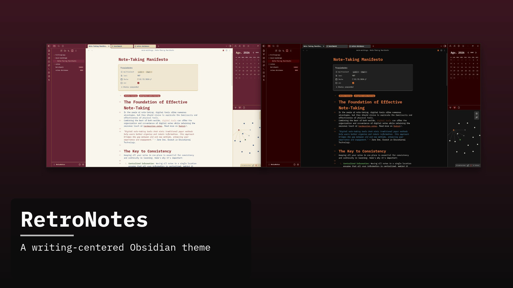
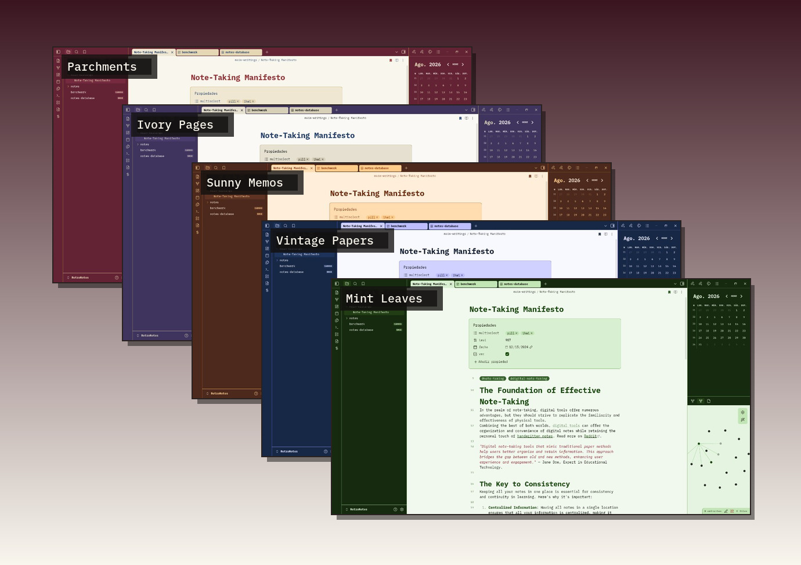
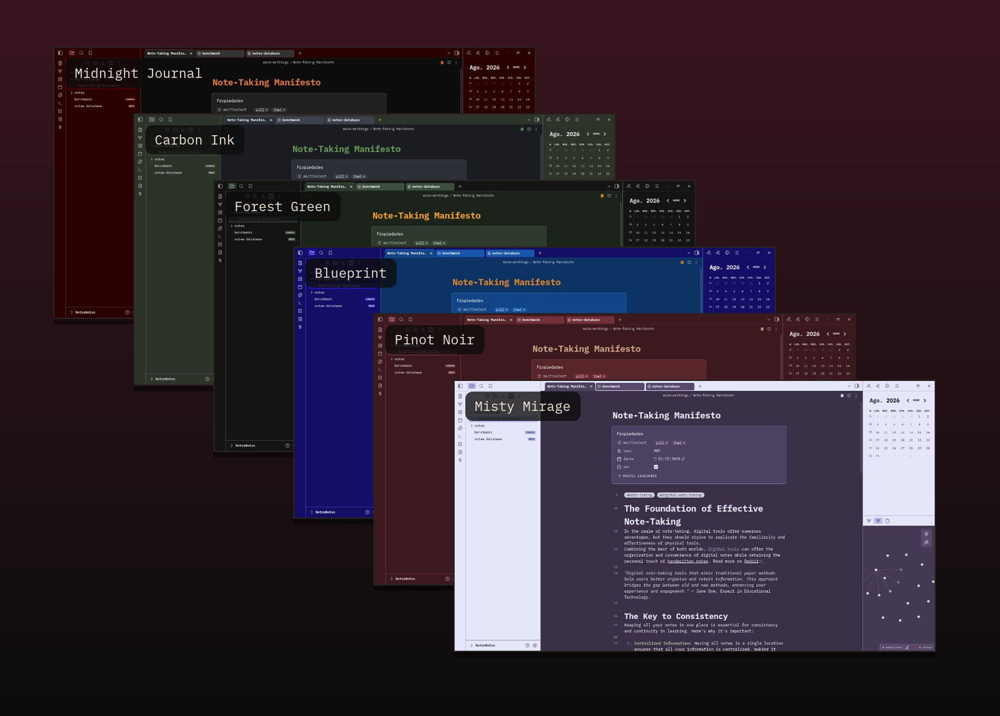

# RetroNotes

A writing-centered [Obsidian](https://obsidian.md) theme by [Rubén Campelo](https://rubencampelo.com).

  

Warm palettes, embedded **IBM Plex Mono**, and eleven schemes you can switch with Style Settings.

## Features

- **Less is more** — a calm UI with a satisfying color palette, not flashy chrome
- **No distraction** — only the essentials are highlighted
- **Writing-centered** — layout and typography built around long-form notes
- **IBM Plex Mono** — embedded in the theme; no font install required
- **Style Settings** — pick light and dark schemes independently

## Color schemes

Eleven palettes (five light, six dark). Defaults are **Parchments** and **Midnight Journal**.

### Light

  

Parchments · Ivory Pages · Sunny Memos · Vintage Papers · Mint Leaves

### Dark

  

Midnight Journal · Carbon Ink · Forest Green · Blueprint · Pinot Noir · Misty Mirage

Install [Style Settings](https://github.com/mgmeyers/obsidian-style-settings) to switch schemes from the settings panel.

## Note

This is a personal theme. Contrast and color choices may not suit every plugin. Issues and pull requests are welcome — I will review them when I can.

**Tested with:** [Calendar](https://github.com/liamcain/obsidian-calendar-plugin) by @liamcain

## Recommended plugins

- [Better Word Count](https://github.com/lukeleppan/better-word-count) by Luke Leppan
- [Calendar](https://github.com/liamcain/obsidian-calendar-plugin) by @liamcain
- [Latex Suite](https://github.com/artisticat1/obsidian-latex-suite) by artisticat
- [Quick Switcher++](https://github.com/darlal/obsidian-switcher-plus) by darlal
- [Smart Typography](https://github.com/mgmeyers/obsidian-smart-typography) by @mgmeyers
- [Style Settings](https://github.com/mgmeyers/obsidian-style-settings) by @mgmeyers — required to switch alternative color schemes
- [Templater](https://github.com/SilentVoid13/Templater) by SilentVoid
- [Typewriter Scroll](https://github.com/deathau/cm-typewriter-scroll-obsidian) by @death_au

---

Made by [Rubén Campelo](https://rubencampelo.com)
